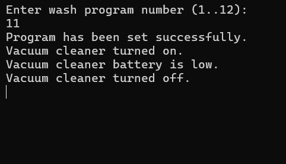
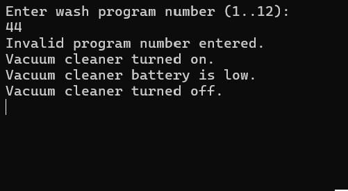

# Home Devices Management System

A C# console application demonstrating Object-Oriented Programming (OOP) principles such as inheritance, encapsulation, and validation. Developed as part of the INF.04 vocational examination.

## Project Structure
- **Device (Base Class):** Contains a public method `DisplayMessage` to output information to the console.
- **WashingMachine (Subclass):** - Manages a private `_programNumber`.
  - Validates program input within the range 1–12.
- **VacuumCleaner (Subclass):** - Tracks power state (On/Off) via a private boolean.
  - Prevents redundant state changes (only outputs messages when the state actually flips).

## Requirements Covered
- Use of `private` access modifiers for field encapsulation.
- Inheritance from a common base class.
- Logic to handle invalid user input (defaults to 0 if key is not an integer).

## Visual Demonstration

  
  

*Left: Valid program number (11). Right: Invalid program number (44).*

## How to Run
1. Open the solution in Visual Studio.
2. Run the project (`F5`).
3. Enter a number for the washing machine program when prompted.
