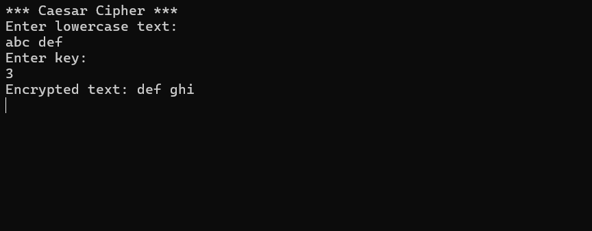
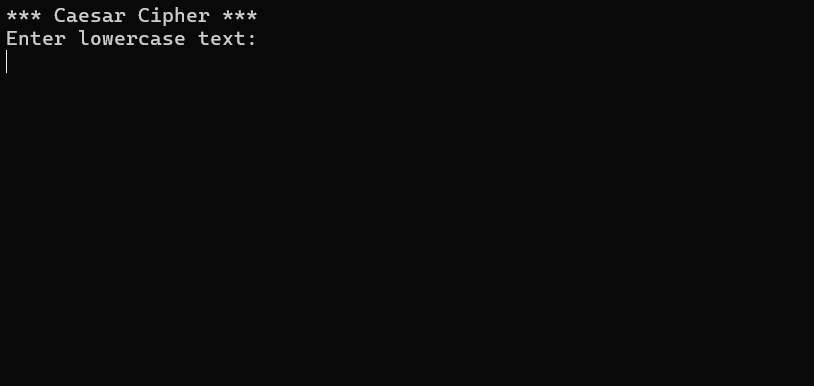

# Caesar Cipher (Console Application)

A console-based implementation of the Caesar Cipher algorithm, developed for the INF.04 vocational exam. The application encrypts lowercase Latin characters while preserving spaces.

## Features
- **Flexible Key Support:** Handles positive, negative, and large integer keys (e.g., k=100 or k=-3).
- **Exam Compliant:** Strictly follows the requirement to only encrypt `a-z` and ignore spaces.
- **Robust Logic:** Uses modulo arithmetic to ensure correct alphabet rotation.

## The Algorithm
The core encryption logic uses the following formula to determine the new character index:

$$NewIndex = (CurrentIndex + (Key \bmod 26) + 26) \bmod 26$$

This ensures that the alphabet "wraps around" (z -> a) and correctly handles negative shifts (a -> z).

## Visuals

  
  

## Technical Stack
- **Language:** C#
- **Platform:** .NET Console App
- **Key Concepts:** ASCII math, Modulo arithmetic, Static methods.

## Usage
1. Run the application.
2. Enter a string containing lowercase letters and spaces.
3. Enter an integer key (shift value).
4. The program will output the encrypted result.