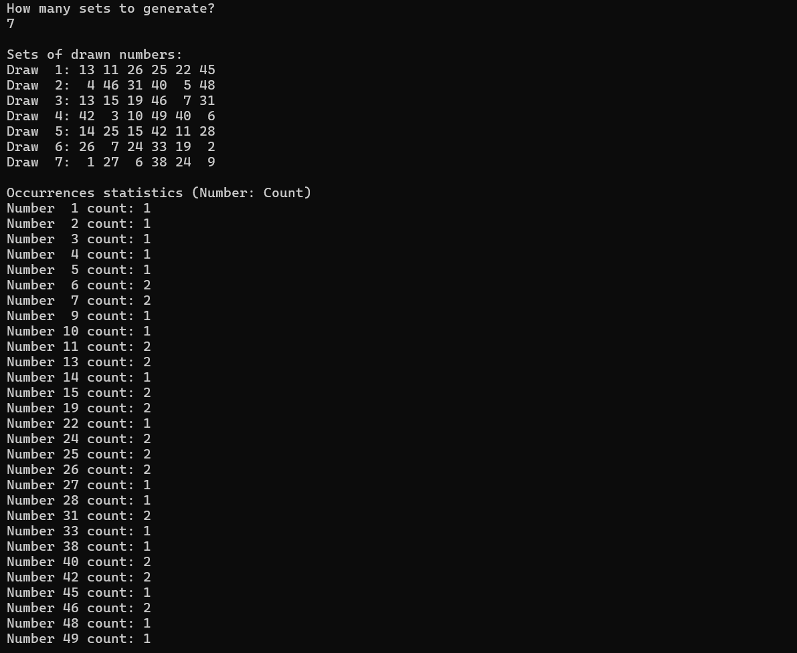

# Lottery Number Simulator (Lotto)

A console application developed as part of the INF.04 vocational exam. The program simulates a lottery draw by generating unique sets of numbers and calculating statistical occurrences.

## Features
- **Custom Draws:** User defines how many sets of 6 numbers to generate.
- **Unique Numbers:** Each set contains 6 unique random integers from the range <1, 49>.
- **Statistics:** Calculates and displays total occurrences of each number across all sets.
- **Formatted Output:** Clear, aligned console interface for better readability.

## Preview

## Technical Details
- **Language:** C#
- **Platform:** .NET / Console Application
- **Data Structures:** 2D Array for storing results, HashSet for ensuring uniqueness.

## How to Run
1. Open the project in Visual Studio.
2. Build and run the application (F5).
3. Enter the number of sets when prompted.