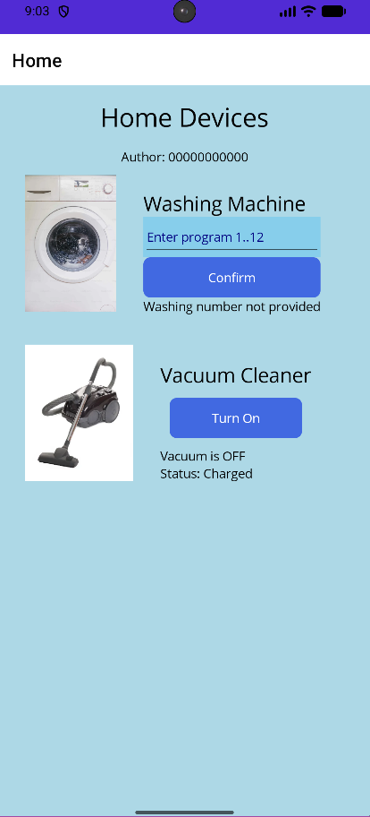
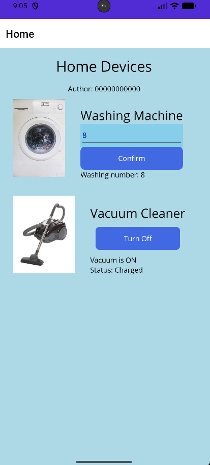

# Home Devices Mobile App (.NET MAUI)

A cross-platform mobile application designed to manage home appliances (Washing Machine and Vacuum Cleaner). This project demonstrates UI layout techniques using XAML and event handling in C#.

## Key Features
- **Washing Machine Controller:** Validates user input (range 1-12) and provides real-time feedback on the selected program.
- **Vacuum Cleaner Toggle:** Implements state management to switch between "On" and "Off" modes, updating both button text and status labels dynamically.
- **Exam-Compliant Styling:**
  - **Background:** `#ADD8E6` (LightBlue)
  - **Input Fields:** `#87CEEB` (SkyBlue) with `Navy` text
  - **Buttons:** `#4169E1` (RoyalBlue)
  - **Margins:** Specific external margins for labels (5), buttons (10), and images (20).

## Technical Implementation
- **Resource Management:** Image filenames use underscores (e.g., `washing_machine.jpg`) to comply with Android's strict alphanumeric naming conventions, preventing build errors.
- **UI Architecture:** Utilizes nested `VerticalStackLayout` and `HorizontalStackLayout` inside a `ScrollView` for a responsive design.

## UI Demonstration

  
  

*Left: Initial state. Right: Application after user interaction (program set, vacuum on).*
